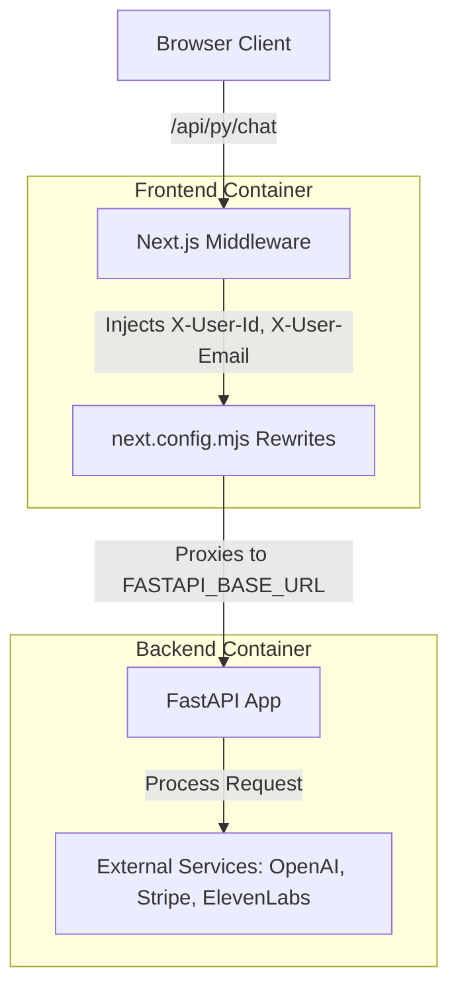

# Validation Procedure: End-to-End Request Flow

This document outlines the validation steps to ensure the containerized system's request flow and environment configuration are functioning correctly.

## Request Flow Overview

## Validation Steps

### 1. Middleware Header Injection
**Goal:** Verify that `src/middleware.ts` correctly intercepts requests and injects user context headers.

- **Check:** Inspect `src/middleware.ts`. Ensure it checks for `url.pathname.startsWith('/api/py/')`.
- **Verify:** Confirm `headers.set("X-User-Id", userId)` and `headers.set("X-User-Email", email)` are called before `NextResponse.next()`.

### 2. Next.js Proxy Rewrites
**Goal:** Verify that `next.config.mjs` correctly proxies requests to the backend service.

- **Check:** Inspect `next.config.mjs`. Ensure `rewrites()` includes a mapping from `/api/py/:path*` to `${FASTAPI_BASE_URL}/:path*`.
- **Verify:** Confirm `FASTAPI_BASE_URL` defaults to `http://localhost:8000` (for local dev) but is overridden by the value in `docker-compose.yml` (`http://backend:8000`).

### 3. FastAPI Backend Context Handling
**Goal:** Verify the backend receives proxied requests with user headers.

- **Check:** Inspect `backend/app/api/routes.py`.
- **Verify:** Confirm endpoints like `@router.post("/api/chat")` use `x_user_id: str = Header(...)` to receive the injected context.

### 4. Stripe Payments Flow
**Goal:** Validate the end-to-end Stripe payment integration.

1. **Frontend Checkout:** Client initiates checkout, calling a backend endpoint (e.g., `/api/py/payments/checkout`).
2. **Backend Processing:** Backend (`backend/app/api/payments.py`) uses `STRIPE_SECRET_KEY` to create a Stripe Session and returns the session URL.
3. **Stripe API:** Request travels to Stripe's servers.
4. **Webhook Callback:** Stripe sends an asynchronous event back to the backend's `/payments/webhook` endpoint.
5. **Webhook Verification:** Backend uses `STRIPE_WEBHOOK_SECRET` to verify the event's authenticity.

### 5. Service Health and Dependency
**Goal:** Ensure the frontend only starts when the backend is ready.

- **Check:** `docker-compose.yml`. Verify `backend` has a `healthcheck` probing `http://localhost:8000/health`.
- **Check:** `docker-compose.yml`. Verify `frontend` has `depends_on: backend: condition: service_healthy`.
- **Verify:** Run `docker compose up`. Observe that the frontend container wait for the backend to report "healthy" before starting.
